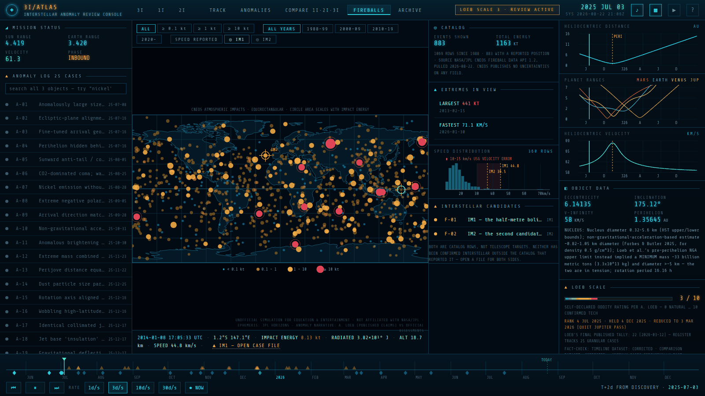

<div align="center">

# 3I/ATLAS — Interstellar Anomaly Review Console

**A mission-control terminal for the only three objects ever seen entering our solar system from interstellar space.**

Real trajectories. Real measurements. Both sides of every argument.

[](https://3i-atlas-anomaly-console.pages.dev)
[](https://3i-atlas-anomaly-console.pages.dev/about.html)
[](LICENSE)


### ▶ **[Launch the console](https://3i-atlas-anomaly-console.pages.dev)**

</div>


---

## What this is

In 2017 a tumbling, tail-less object called **1I/ʻOumuamua** passed through the solar system and
accelerated on its way out with nothing visibly pushing it. In 2019 **2I/Borisov** arrived and
behaved like a perfectly ordinary comet. In 2025 **3I/ATLAS** came through on the most extreme
hyperbolic orbit ever measured, and Harvard astronomer Avi Loeb began publishing a numbered list
of things about it he considered anomalous — eventually reaching 22 items.

Most astronomers say it's a comet. Loeb says the list deserves an answer.

**This console doesn't pick for you.** Every case file states what was measured, what Loeb
concluded, and what the mainstream explanation is — with sources — and then lets you fly the
actual geometry and judge whether the story holds up.

| Target | Era | Cases | Character |
|---|---|:--:|---|
| **3I/ATLAS** (C/2025 N1) | 2025–26 | 25 | The active case — CO₂-rich, with a long anomaly register |
| **1I/ʻOumuamua** | 2017–18 | 11 | The original — inert, elongated, accelerating with no tail |
| **2I/Borisov** (C/2019 Q4) | 2019–20 | 5 | The control — an ordinary comet from another star |
| **CNEOS fireballs** | 1988– | 2 | The impact catalog — two rows argued to be interstellar meteors |

---

## The views

### Case files — the argument, three ways

Every anomaly is logged as a numbered case: the **observation** (what was measured), **Loeb's
assessment** (with sourced quotes and the probabilities he assigned), and the **official
explanation** (the mainstream account, with its own paper trail). A verification chip records
whether the entry survived fact-checking unchanged, and references link out.


### Fireballs — 1,069 atmospheric impacts, and two disputed rows

Every bolide US Government sensors have logged since 1988, plotted where it burned: circle area
scales with impact energy, from sub-kiloton flashes up to **Chelyabinsk at 441 kt**. Filter by
energy or decade, hover any dot for its full CNEOS row, and find the two events Avi Loeb argues
arrived from outside the solar system — **IM1** (2014-01-08, off Papua New Guinea) and **IM2**
(2017-03-09, west of Portugal), each under a reticle with its own case file.

**Is the fireball rate rising?** A recurring online claim says NASA's own data shows impacts
climbing. The register answers it from the shipped catalog: a **detections-per-year** chart in
the stats rail, and case **F-03**, which computes the rates. The short version — the record
steps twice (1994, 2000) and is then flat for 26 years, and the ≥1 kt subset, which a
detection-rate change cannot inflate, runs 4.1 / 4.1 / 3.7 per year across those decades.
`tools/fireball_rate_check.py` re-derives every figure F-03 quotes and fails the monthly
refresh if the catalog moves under it.

The speed histogram is the argument in one picture: the catalog's reported speeds, IM1 and IM2
marked, and shaded behind them the 10–15 km/s velocity uncertainty Brown & Borovička measured for
these sensors — enough, if real, to move IM1's orbit from unbound to ordinary.



### The timeline is a register too

Every marker on the scrubber opens a record: what happened, in full, with its sources as
clickable links. Mission entries (cyan, below the line) and anomaly case files (amber, above
it) use the same sheet. **Drag = time, tap = record.**

Some entries have no marker — 1I/ʻOumuamua's story runs to 2026 while its ephemeris window
stops in 2018, so 9 of its 16 entries sit off the end of its scrubber. The **MISSION LOG**
tab in the left rail lists all of them, searchable across every object.

### Search across all four registers at once

The case log searches all 49 case files, not just the object you're viewing — and the
MISSION LOG tab does the same across all 58 timeline records. Searching **`nickel`**
returns 3I/ATLAS's anomaly *and* 2I/Borisov's rebuttal — the same measurement, argued two ways,
side by side. Foreign results are badged by object; clicking one switches target and opens it — including the
fireball cases, which live in their own register rather than an era.


### Switch targets — the whole console re-scopes

| | |
|---|---|
|  |  |
| **1I/ʻOumuamua** renders inert and tumbling with **no tail at all** — because that absence *is* the anomaly. Its own era, timeline, close approaches and telemetry. | **Compare** draws all three trajectories at once over a parameter table: eccentricity, inclination, v-infinity, size, and what Loeb argued about each. |

### Archive and boot

| | |
|---|---|
|  |  |
| In-world **declassified documents**, a sourced quote board, and DSN tracking logs. The redaction bars are clickable. | The **boot sequence** runs subsystem checks and Deep Space Network link acquisition. The keypress that authenticates you also unlocks the audio. |

---

## Running it

**Online:** <https://3i-atlas-anomaly-console.pages.dev>

**Offline:** open `public/index.html` — or the identical `_LATEST - 3I-ATLAS Anomaly Console.html` —
in any modern browser. No server, no install, no network. Everything (three.js, the font, the
ephemeris, the fireball catalog, all 49 case files) is inlined into one ~1.4 MB file with
**zero external references**.

Press any key at the boot screen to authenticate; that gesture also unlocks the audio.
Press <kbd>?</kbd> at any time for the full control legend.

| Key | Action |
|---|---|
| <kbd>T</kbd> | **Guided tour** — 9 narrated beats across all three objects and the impact map, ~100s |
| <kbd>Space</kbd> | Play / pause the replay |
| <kbd>←</kbd> <kbd>→</kbd> | Step a day (with <kbd>Shift</kbd>, a week) |
| <kbd>1</kbd>…<kbd>5</kbd> | Track / Anomalies / Compare / Fireballs / Archive |

On a phone or tablet everything is touch-driven: drag the timeline to scrub, tap a marker to
jump to it, tap a dot on the impact map to read its row. The side rails become slide-over
panels via the ◧ / ◨ buttons, and the tour starts from the ▶ button.
| <kbd>N</kbd> | Jump to today's real position |
| <kbd>M</kbd> <kbd>L</kbd> <kbd>G</kbd> | Mute · labels · grid |
| <kbd>?</kbd> | Controls and briefing |

**Try:** the guided tour if you're new; searching `nickel`; the **CHASE** camera around
perihelion; case **A-05** → *Visualize in tracker* to watch the tail point the wrong way;
**FROM MARS** on 2025-10-03; **FIREBALLS** → *◎ IM1* to put the disputed 2014 bolide under a
reticle; and the redaction bars in **ARCHIVE**.

### Linking to a specific case

The URL hash is `#<object>[/<case-id>|/<record-id>|/<mode>]`, so any of the 49 case files —
and any of the 58 timeline records — is directly linkable:

- [`#3i/A-05`](https://3i-atlas-anomaly-console.pages.dev/#3i/A-05) — the sunward anti-tail
- [`#1i/O-06`](https://3i-atlas-anomaly-console.pages.dev/#1i/O-06) — ʻOumuamua's non-gravitational acceleration
- [`#2i`](https://3i-atlas-anomaly-console.pages.dev/#2i) — the Borisov control case
- [`#fb/F-01`](https://3i-atlas-anomaly-console.pages.dev/#fb/F-01) — IM1, the 2014 bolide claimed as an interstellar meteor
- [`#1i/E-20181026`](https://3i-atlas-anomaly-console.pages.dev/#1i/E-20181026) — the day the lightsail paper landed
- [`#3i/compare`](https://3i-atlas-anomaly-console.pages.dev/#3i/compare) — all three trajectories

Every dossier has a **⧉ COPY LINK** button.

---

## Where the data comes from

The aesthetic is fiction. The numbers are not.

**Trajectories** are daily state vectors for each object and all eight planets, pulled from the
NASA/JPL **Horizons** system in heliocentric ecliptic J2000 — a separate era for each object's
transit window. Close approaches are computed from those vectors and match published values:
3I/ATLAS passes Mars at 0.194 AU on 2025-10-03, reaches perihelion at 1.357 AU on 2025-10-29,
and is closest to Earth at 1.798 AU on 2025-12-19.

**Fireballs** are the live **CNEOS Fireball Data API** table — every atmospheric impact event US
Government sensors have reported since 1988-04-15, with date, radiated energy, calculated total
impact energy and, where published, position, altitude and pre-entry speed. Nothing about the two
candidate rows is hand-entered: they are tagged by date, so a catalog revision propagates. CNEOS
publishes no uncertainties on any field, which is the crux of the IM1/IM2 dispute and is stated
in the console wherever the numbers appear. Coastlines are **Natural Earth 1:110m** land (public
domain), simplified to ~2,200 vertices at build time.

**Case files, timelines and quotes** were assembled by a multi-agent research pass and then put
through **per-case adversarial fact-checking** against primary sources — arXiv, Nature, ApJL,
ESO/ESA/NASA releases, and Loeb's own essays. Each case displays its verdict (`CONFIRMED` /
`CORRECTED`) and links to its references. Dataset-level sweeps were run over the timelines and
the comparison table as well.

**Illustrative charts** — spectra, polarization curves, acceleration residuals — depict a
published result rather than plotting raw data, and are labeled as stylized reconstructions.
Orbital geometry and the light-curve model are computed from the real ephemeris.

---

## Building from source

```bash
python tools/fetch_ephemeris.py   # 3 eras of JPL Horizons vectors -> data/ + src/
python tools/fetch_fireballs.py   # CNEOS bolides + Natural Earth land -> data/ + src/
python tools/fetch_ams.py         # AMS eyewitness report-count bins -> data/
python tools/fetch_gmn.py         # Global Meteor Network photometry -> data/
python tools/fetch_volcanoes.py   # NOAA volcano positions -> data/
python tools/fetch_nuclear.py     # WRI nuclear reactor positions -> data/
python tools/fetch_nuforc.py      # NUFORC sighting aggregates -> data/
python tools/spatial_test.py --save                    # fireball/volcano Monte Carlo
python tools/spatial_test.py --target nuclear --save   # fireball/nuclear-site Monte Carlo
python tools/bake_content.py      # research payloads -> src/data-content.js
python tools/bake_instruments.py  # the cross-dataset summaries the charts read
python tools/make_og_image.py     # render the social card from real trajectory data
python tools/build.py             # inline everything -> public/index.html + about.html
python tools/refresh_report.py    # what did that refresh actually change? (markdown)
python tools/fireball_rate_check.py   # re-derive every figure cases F-03..F-07 quote
```

### Reading the claims at source

Several case files argue with claims that were made in videos. `tools/fetch_transcripts.py`
wraps [yt-dlp](https://github.com/yt-dlp/yt-dlp) to pull a channel's captions in bulk, flatten
YouTube's scrolling auto-captions into clean prose, and drop them in `data/transcripts/`:

```bash
pip install -U yt-dlp
python tools/fetch_transcripts.py --list                      # see what would be fetched
python tools/fetch_transcripts.py --match fireball,meteor     # just the relevant ones
python tools/fetch_transcripts.py --since 2025-08-01
```

Run it from a normal home connection — YouTube blocks datacenter IPs outright, so this fails
from a cloud shell with *"Sign in to confirm you're not a bot"*. If you hit that at home,
add `--cookies-from-browser chrome`. `data/transcripts/` **is tracked here**, by the owner's
decision, with attribution and a per-video index in `data/transcripts/README.md`; the batched
copies under `notebook/` exist so a research notebook can ingest the corpus by URL. What the
console itself ships is the analysis derived from them — a case file stating the claim, with
its rebuttal and sources beside it.

### Keeping the data fresh

The datasets are baked into the bundle, so they freeze at whatever the last build
pulled — and CNEOS adds fireball rows continuously. `.github/workflows/refresh-data.yml`
re-pulls upstream on the 1st of each month, rebuilds, and **opens a pull request** if
anything actually changed. It never pushes to `main`: a row the case files quote can be
revised upstream, so a human reads the diff first. The PR body is generated by
`tools/refresh_report.py`, which lists new rows, withdrawn rows, upstream revisions, and
flags loudly if the IM1 or IM2 row moved. Run it by hand from the Actions tab any time;
tick **ephemeris** there to also re-pull JPL Horizons.

```
src/
  console.css        design system (cx- prefix)
  js/core.js         state, era/time engine, ephemeris interpolation, WebAudio synth
  js/scene3d.js      three.js scene: starfield, planets, comet tails, cameras
  js/charts.js       canvas telemetry + per-case dossier charts
  js/fireballs.js    CNEOS impact map: projection, filters, hit testing, stats
  js/ui.js           DOM, boot, timeline, dossiers, search, tour, deep links
  js/main.js         boot flow + frame loop (APP_VERSION lives here)
  about.html         the project landing page
  data-*.js          GENERATED — never hand-edit
tools/               fetch / bake / build / og-image scripts
public/              deploy output: index.html, about.html, og-image.png, shots/
```

Source of truth is `src/`. `src/index.html` is a dev runner that loads the modules unbundled.
`tools/build.py` emits both the offline single-file build and the deployable `public/` directory
from the same bytes. Architecture notes are in [CLAUDE.md](CLAUDE.md); release history in
[_CHANGELOG.md](_CHANGELOG.md).

Deployment is continuous: a push to `main` rebuilds from source, refuses to ship a stale bundle,
and deploys to Cloudflare Pages.

---

## Disclaimer

Unofficial simulation built for education and entertainment. **Not affiliated with, endorsed by,
or produced by NASA, JPL, ESA or any government agency.** The "Interstellar Object Working
Group", its clearance banners and its declassified memoranda are fiction. The ephemerides,
measurements, quotations and citations are real and sourced.

Licensed MIT — see [LICENSE](LICENSE), which also covers the bundled three.js and Share Tech Mono
dependencies and the status of quoted material.
