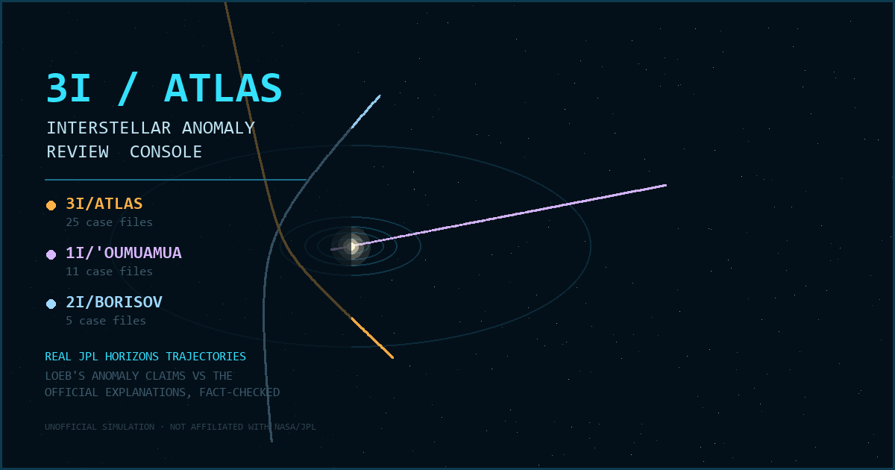

# 3I/ATLAS — Interstellar Anomaly Review Console

A single-file, offline-capable "mission control" terminal for the three confirmed
interstellar objects: **3I/ATLAS**, **1I/ʻOumuamua** and **2I/Borisov**.

Real trajectories. Real measurements. Both sides of the argument.



---

## What it is

You log into a workstation of the (fictional) *Interstellar Object Working Group* and fly
each visitor through the solar system on its actual path. Pick a target from the top bar and
the whole console re-scopes to it — trajectory, planet positions, timeline window, close
approaches, telemetry charts and anomaly log.

The narrative spine is Avi Loeb's running list of claimed anomalies. Every numbered case file
shows three things side by side:

- **the observation** — what was actually measured, with numbers
- **Loeb's interpretation** — with sourced quotes and the probabilities he assigned
- **the official explanation** — the mainstream natural account, with its own paper trail

So you can weigh them yourself rather than being told what to think.

| Target | Era | Case files | Character |
|---|---|---|---|
| 3I/ATLAS (C/2025 N1) | 2025–26 | 25 | The active case — CO₂-rich comet with a long anomaly register |
| 1I/ʻOumuamua | 2017–18 | 11 | The original — inert, tumbling, accelerating with no visible tail |
| 2I/Borisov (C/2019 Q4) | 2019–20 | 5 | The control case — an ordinary comet from another star |

## The data is real

- **Trajectories and planet positions** come from the NASA/JPL **Horizons** system — daily
  state vectors for each object plus all eight planets across that object's transit window,
  heliocentric ecliptic J2000. Close approaches are computed from those vectors and match the
  published values (3I/ATLAS: Mars 0.194 AU on 2025-10-03, perihelion 1.357 AU on 2025-10-29,
  Earth 1.798 AU on 2025-12-19, Jupiter 0.359 AU on 2026-03-17).
- **Case files, timelines and quotes** were assembled by a multi-agent research pass and then
  put through per-case adversarial fact-checking against primary sources — arXiv papers,
  Nature/ApJL, ESO/ESA/NASA releases and Loeb's own essays. Each case displays its verdict
  chip (`CONFIRMED` / `CORRECTED`) and links to its references.

Charts that illustrate a published result rather than plotting raw data (spectra,
polarization curves, acceleration residuals) are stylized reconstructions and are labeled as
such; the orbital geometry and the light-curve model are computed from the real ephemeris.

## Running it

Open `public/index.html` — or the identical `_LATEST - 3I-ATLAS Anomaly Console.html` — in any
modern browser. No server, no install, no network access required. Everything (three.js, the
font, the ephemeris, the case files) is inlined into one ~1.3 MB file.

Press any key at the boot screen to authenticate; that gesture also unlocks the audio.
Press **?** at any time for the full control legend.

| Key | Action |
|---|---|
| `T` | **guided tour** — 8 beats across all three objects, ~90s |
| `SPACE` | play / pause the replay |
| `←` `→` | step a day (with `SHIFT`, a week) |
| `1` `2` `3` `4` | Track / Anomalies / Compare / Archive |
| `N` | jump to today's real position |
| `M` `L` `G` | mute · labels · grid |
| `?` | controls and briefing |

Try: the **guided tour** if you're new; searching **"nickel"** in the case log, which returns
3I/ATLAS's anomaly *and* 2I/Borisov's control-case rebuttal side by side; the **CHASE** camera
around perihelion; case **A-05** → *Visualize in tracker* to watch the tail point the wrong
way; **FROM MARS** on 2025-10-03; and the clickable redaction bars in **ARCHIVE**.

### Linking to a specific case

The URL hash is `#<object>[/<case-id>|/<mode>]`, so you can link straight to any of the 41
case files — [`#3i/A-05`](https://3i-atlas-anomaly-console.pages.dev/#3i/A-05) (the sunward
anti-tail), [`#1i/O-04`](https://3i-atlas-anomaly-console.pages.dev/#1i/O-04),
[`#2i`](https://3i-atlas-anomaly-console.pages.dev/#2i),
[`#3i/compare`](https://3i-atlas-anomaly-console.pages.dev/#3i/compare). Every dossier has a
**⧉ COPY LINK** button.

## Building from source

```bash
python tools/fetch_ephemeris.py   # pull 3 eras of JPL Horizons vectors -> data/ + src/
python tools/bake_content.py      # research payloads -> src/data-content.js
python tools/make_og_image.py     # render the social card
python tools/build.py             # inline everything -> public/index.html
```

Source of truth is `src/` (`console.css`, `js/core.js`, `js/scene3d.js`, `js/charts.js`,
`js/ui.js`, `js/main.js`). `src/index.html` is a dev runner that loads those files unbundled.
Never hand-edit `src/data-*.js` — they are generated. Architecture notes live in
[`CLAUDE.md`](CLAUDE.md); release history in [`_CHANGELOG.md`](_CHANGELOG.md).

## Disclaimer

Unofficial simulation built for education and entertainment. **Not affiliated with, endorsed
by, or produced by NASA, JPL, ESA or any government agency.** The "Interstellar Object Working
Group", its clearance banners and its declassified memos are fiction; the ephemerides,
measurements, quotations and citations are real and sourced.

Licensed MIT — see [LICENSE](LICENSE) for the terms covering bundled dependencies and quoted
material.
