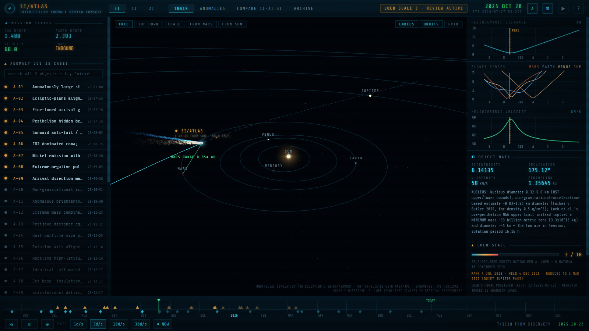
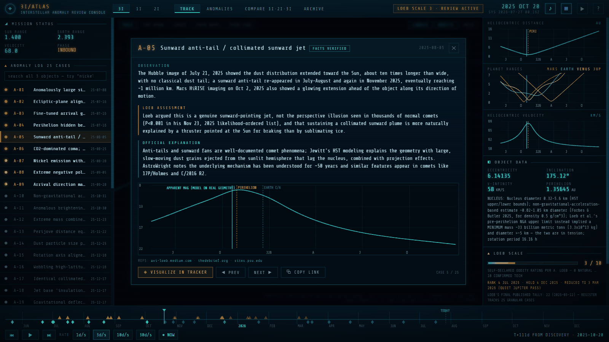
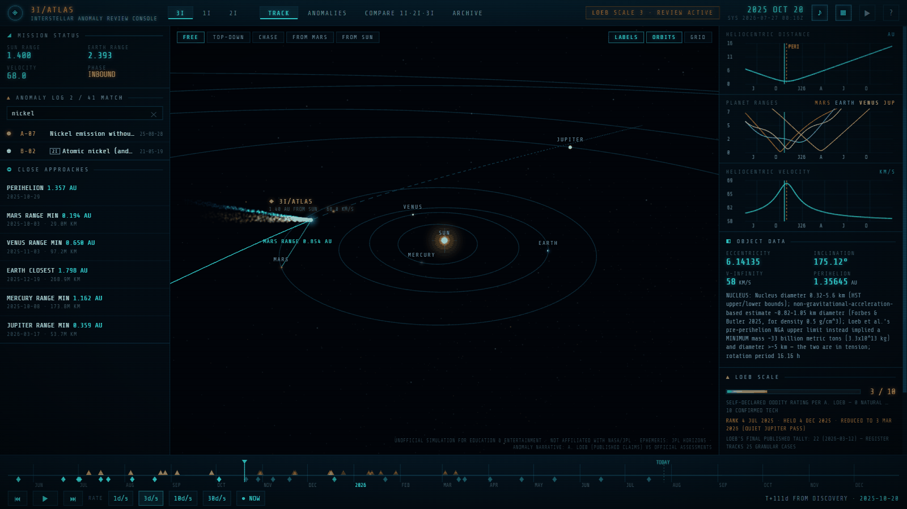
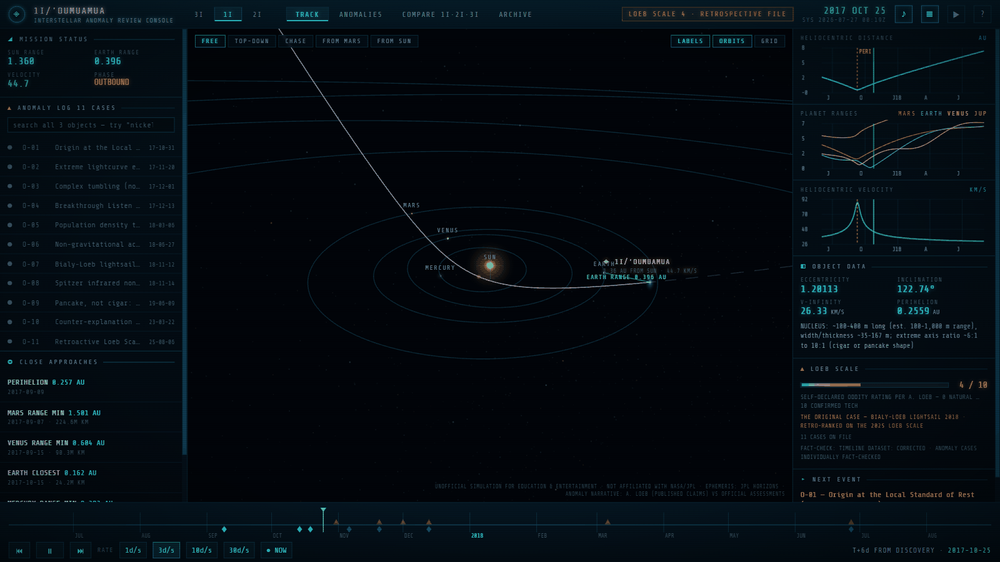
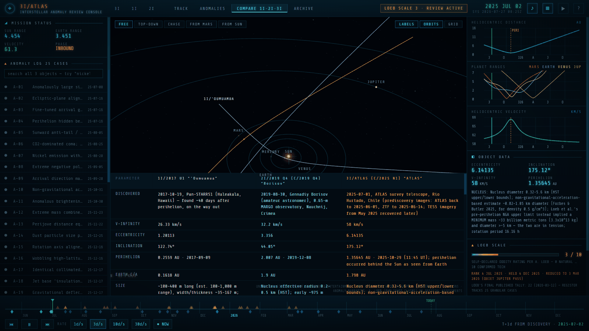
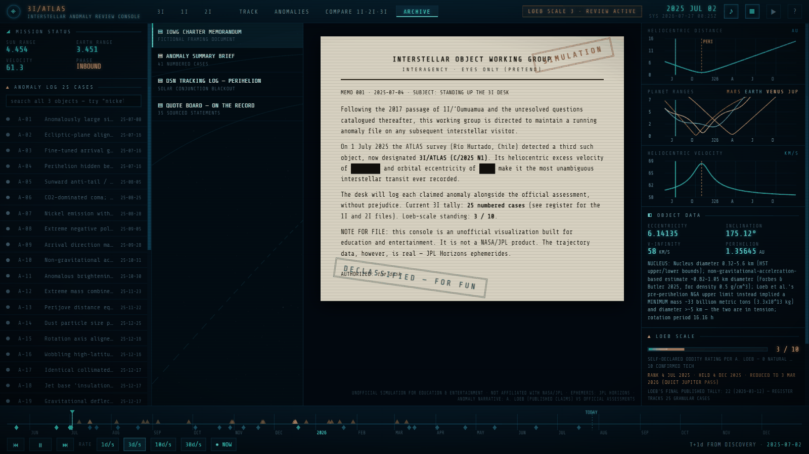
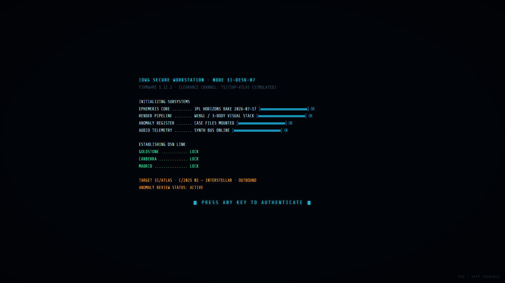

<div align="center">

# 3I/ATLAS — Interstellar Anomaly Review Console

**A mission-control terminal for the only three objects ever seen entering our solar system from interstellar space.**

Real trajectories. Real measurements. Both sides of every argument.

[](https://3i-atlas-anomaly-console.pages.dev)
[](https://3i-atlas-anomaly-console.pages.dev/about.html)
[](LICENSE)


### ▶ **[Launch the console](https://3i-atlas-anomaly-console.pages.dev)**

</div>



---

## What this is

In 2017 a tumbling, tail-less object called **1I/ʻOumuamua** passed through the solar system and
accelerated on its way out with nothing visibly pushing it. In 2019 **2I/Borisov** arrived and
behaved like a perfectly ordinary comet. In 2025 **3I/ATLAS** came through on the most extreme
hyperbolic orbit ever measured, and Harvard astronomer Avi Loeb began publishing a numbered list
of things about it he considered anomalous — eventually reaching 22 items.

Most astronomers say it's a comet. Loeb says the list deserves an answer.

**This console doesn't pick for you.** Every case file states what was measured, what Loeb
concluded, and what the mainstream explanation is — with sources — and then lets you fly the
actual geometry and judge whether the story holds up.

| Target | Era | Cases | Character |
|---|---|:--:|---|
| **3I/ATLAS** (C/2025 N1) | 2025–26 | 25 | The active case — CO₂-rich, with a long anomaly register |
| **1I/ʻOumuamua** | 2017–18 | 11 | The original — inert, elongated, accelerating with no tail |
| **2I/Borisov** (C/2019 Q4) | 2019–20 | 5 | The control — an ordinary comet from another star |

---

## The views

### Case files — the argument, three ways

Every anomaly is logged as a numbered case: the **observation** (what was measured), **Loeb's
assessment** (with sourced quotes and the probabilities he assigned), and the **official
explanation** (the mainstream account, with its own paper trail). A verification chip records
whether the entry survived fact-checking unchanged, and references link out.



### Search across all three objects at once

The case log searches all 41 files, not just the object you're viewing. Searching **`nickel`**
returns 3I/ATLAS's anomaly *and* 2I/Borisov's rebuttal — the same measurement, argued two ways,
side by side. Foreign results are badged by object; clicking one switches target and opens it.



### Switch targets — the whole console re-scopes

| | |
|---|---|
|  |  |
| **1I/ʻOumuamua** renders inert and tumbling with **no tail at all** — because that absence *is* the anomaly. Its own era, timeline, close approaches and telemetry. | **Compare** draws all three trajectories at once over a parameter table: eccentricity, inclination, v-infinity, size, and what Loeb argued about each. |

### Archive and boot

| | |
|---|---|
|  |  |
| In-world **declassified documents**, a sourced quote board, and DSN tracking logs. The redaction bars are clickable. | The **boot sequence** runs subsystem checks and Deep Space Network link acquisition. The keypress that authenticates you also unlocks the audio. |

---

## Running it

**Online:** <https://3i-atlas-anomaly-console.pages.dev>

**Offline:** open `public/index.html` — or the identical `_LATEST - 3I-ATLAS Anomaly Console.html` —
in any modern browser. No server, no install, no network. Everything (three.js, the font, the
ephemeris, all 41 case files) is inlined into one ~1.3 MB file with **zero external references**.

Press any key at the boot screen to authenticate; that gesture also unlocks the audio.
Press <kbd>?</kbd> at any time for the full control legend.

| Key | Action |
|---|---|
| <kbd>T</kbd> | **Guided tour** — 8 narrated beats across all three objects, ~90s |
| <kbd>Space</kbd> | Play / pause the replay |
| <kbd>←</kbd> <kbd>→</kbd> | Step a day (with <kbd>Shift</kbd>, a week) |
| <kbd>1</kbd> <kbd>2</kbd> <kbd>3</kbd> <kbd>4</kbd> | Track / Anomalies / Compare / Archive |
| <kbd>N</kbd> | Jump to today's real position |
| <kbd>M</kbd> <kbd>L</kbd> <kbd>G</kbd> | Mute · labels · grid |
| <kbd>?</kbd> | Controls and briefing |

**Try:** the guided tour if you're new; searching `nickel`; the **CHASE** camera around
perihelion; case **A-05** → *Visualize in tracker* to watch the tail point the wrong way;
**FROM MARS** on 2025-10-03; and the redaction bars in **ARCHIVE**.

### Linking to a specific case

The URL hash is `#<object>[/<case-id>|/<mode>]`, so any of the 41 case files is directly linkable:

- [`#3i/A-05`](https://3i-atlas-anomaly-console.pages.dev/#3i/A-05) — the sunward anti-tail
- [`#1i/O-06`](https://3i-atlas-anomaly-console.pages.dev/#1i/O-06) — ʻOumuamua's non-gravitational acceleration
- [`#2i`](https://3i-atlas-anomaly-console.pages.dev/#2i) — the Borisov control case
- [`#3i/compare`](https://3i-atlas-anomaly-console.pages.dev/#3i/compare) — all three trajectories

Every dossier has a **⧉ COPY LINK** button.

---

## Where the data comes from

The aesthetic is fiction. The numbers are not.

**Trajectories** are daily state vectors for each object and all eight planets, pulled from the
NASA/JPL **Horizons** system in heliocentric ecliptic J2000 — a separate era for each object's
transit window. Close approaches are computed from those vectors and match published values:
3I/ATLAS passes Mars at 0.194 AU on 2025-10-03, reaches perihelion at 1.357 AU on 2025-10-29,
and is closest to Earth at 1.798 AU on 2025-12-19.

**Case files, timelines and quotes** were assembled by a multi-agent research pass and then put
through **per-case adversarial fact-checking** against primary sources — arXiv, Nature, ApJL,
ESO/ESA/NASA releases, and Loeb's own essays. Each case displays its verdict (`CONFIRMED` /
`CORRECTED`) and links to its references. Dataset-level sweeps were run over the timelines and
the comparison table as well.

**Illustrative charts** — spectra, polarization curves, acceleration residuals — depict a
published result rather than plotting raw data, and are labeled as stylized reconstructions.
Orbital geometry and the light-curve model are computed from the real ephemeris.

---

## Building from source

```bash
python tools/fetch_ephemeris.py   # 3 eras of JPL Horizons vectors -> data/ + src/
python tools/bake_content.py      # research payloads -> src/data-content.js
python tools/make_og_image.py     # render the social card from real trajectory data
python tools/build.py             # inline everything -> public/index.html + about.html
```

```
src/
  console.css        design system (cx- prefix)
  js/core.js         state, era/time engine, ephemeris interpolation, WebAudio synth
  js/scene3d.js      three.js scene: starfield, planets, comet tails, cameras
  js/charts.js       canvas telemetry + per-case dossier charts
  js/ui.js           DOM, boot, timeline, dossiers, search, tour, deep links
  js/main.js         boot flow + frame loop (APP_VERSION lives here)
  about.html         the project landing page
  data-*.js          GENERATED — never hand-edit
tools/               fetch / bake / build / og-image scripts
public/              deploy output: index.html, about.html, og-image.png, shots/
```

Source of truth is `src/`. `src/index.html` is a dev runner that loads the modules unbundled.
`tools/build.py` emits both the offline single-file build and the deployable `public/` directory
from the same bytes. Architecture notes are in [CLAUDE.md](CLAUDE.md); release history in
[_CHANGELOG.md](_CHANGELOG.md).

Deployment is continuous: a push to `main` rebuilds from source, refuses to ship a stale bundle,
and deploys to Cloudflare Pages.

---

## Disclaimer

Unofficial simulation built for education and entertainment. **Not affiliated with, endorsed by,
or produced by NASA, JPL, ESA or any government agency.** The "Interstellar Object Working
Group", its clearance banners and its declassified memoranda are fiction. The ephemerides,
measurements, quotations and citations are real and sourced.

Licensed MIT — see [LICENSE](LICENSE), which also covers the bundled three.js and Share Tech Mono
dependencies and the status of quoted material.
